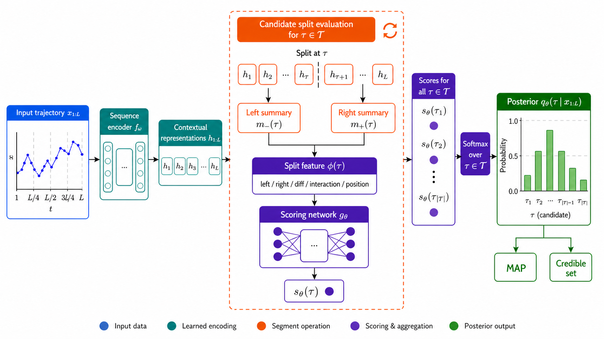
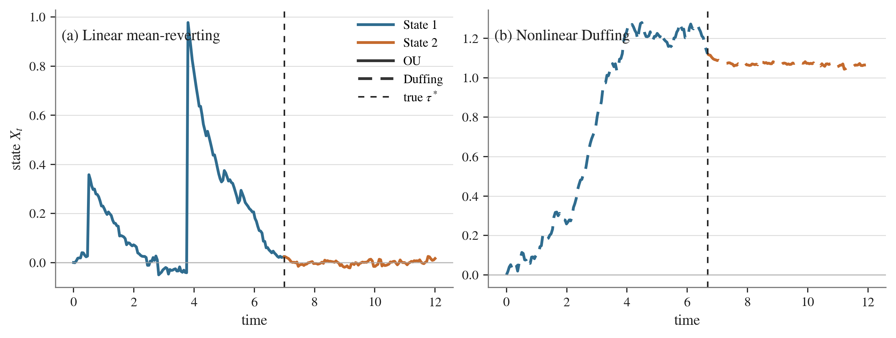
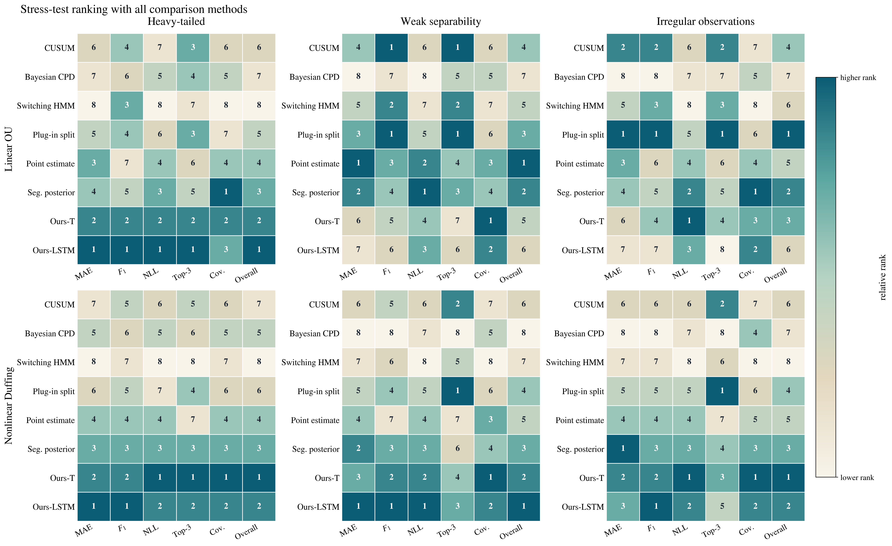

# Switching-Time Posterior Inference for Regime-Switching Stochastic Dynamics

This repository is the public code release for the manuscript
**"Switching-Time Posterior Inference for Regime-Switching Stochastic Dynamics"**.

The project studies offline single-switch inference for stochastic dynamical
systems. Given one observed trajectory, the goal is to infer a distribution over
candidate switching indices rather than only a point estimate. The main method
is the **Candidate Split Posterior Model (CSPM)**: it encodes the full
trajectory, summarizes the two segments induced by each candidate split, scores
the complete left-right partition, and normalizes the scores into a discrete
candidate-index posterior.



## Repository Status

This is a code and reproducibility repository for the paper. It is not the
manuscript source repository.

The public release contains:

- a Python package and command-line interface, `switching-sde`;
- wrappers for the switching OU and switching Duffing experiment families;
- artifact indexing, frozen evaluation, visualization, and report-generation
  utilities;
- checked-in release figures and writing-pipeline outputs used during paper
  development;
- tests for the release layer and artifact-resolution logic.

Large legacy experiment artifacts, datasets, and checkpoints are not committed
to this repository. Full live reruns require access to a local legacy artifact
tree, referred to below as `LEGACY_PENN_ROOT`. The repository can still be
installed, inspected, and tested without that artifact tree.

## Paper Figures

Representative switching trajectories:



Stress-test rank summary:



## Repository Layout

```text
src/switching_sde/       Python package and `switching-sde` CLI
scripts/                 Release, artifact, and preflight helpers
tests/                   Unit, regression, and integration tests
assets/manifests/        Artifact and dataset lock metadata
reports/paper/           Generated paper/release figures and outputs
writing-pipeline/        Auxiliary authoring workflow used during drafting
docs/figures/            README figures copied from the paper source archive
```

The `writing-pipeline/` directory is retained for provenance and drafting
support. The primary code interface for readers of the paper is the
`switching-sde` package under `src/`.

## Installation

```bash
git clone https://github.com/LeeShuaiyu/switching-sde-release.git
cd switching-sde-release

python3 -m venv .venv
source .venv/bin/activate
python -m pip install --upgrade pip setuptools wheel
python -m pip install -e .
```

Check that the CLI is available:

```bash
switching-sde --help
```

## Basic Usage

The CLI exposes artifact, evaluation, visualization, benchmark, and report
commands:

```bash
switching-sde artifacts index --legacy-root "$LEGACY_PENN_ROOT"
switching-sde artifacts link --legacy-root "$LEGACY_PENN_ROOT"

switching-sde eval --experiment id_linear --mode auto \
  --legacy-root "$LEGACY_PENN_ROOT"

switching-sde viz --experiment id_nonlinear --mode auto \
  --legacy-root "$LEGACY_PENN_ROOT"

switching-sde benchmark --suite paper_full --mode frozen \
  --legacy-root "$LEGACY_PENN_ROOT"

switching-sde report --suite paper_full \
  --legacy-root "$LEGACY_PENN_ROOT"
```

Supported benchmark suites:

- `paper_full`: standard linear switching OU benchmark;
- `p5`: linear stress-test suite;
- `p6`: nonlinear switching Duffing benchmark and stress-test suite.

Supported execution modes:

- `live`: run against available checkpoints and datasets in `LEGACY_PENN_ROOT`;
- `frozen`: rebuild summaries from existing benchmark artifacts;
- `auto`: try live execution first and fall back to frozen artifacts.

## Experiments Represented

The release layer tracks the experiment families used in the paper:

- standard switching Ornstein-Uhlenbeck dynamics;
- nonlinear switching Duffing dynamics;
- heavy-tailed perturbation settings;
- weak-separability settings;
- irregular-observation settings;
- neural point-regression and segmentation baselines;
- classical or model-based change-point baselines;
- CSPM variants with recurrent and self-attention encoders.

The experiment configuration files live in
`src/switching_sde/config/experiments/`.

## Testing

Run the lightweight unit and regression tests:

```bash
python -m unittest discover -s tests/unit -p 'test_*.py'
python -m unittest discover -s tests/regression -p 'test_*.py'
```

Integration tests may require `LEGACY_PENN_ROOT` or may fall back to frozen
artifacts depending on the local environment:

```bash
python -m unittest discover -s tests/integration -p 'test_*.py'
```

## Notes on Reproducibility

This repository was built as a clean release layer over a larger legacy
experiment tree. That design has two consequences:

1. The public repository is small enough to clone and inspect.
2. Exact live reproduction of every table and figure requires the legacy
   datasets/checkpoints to be present locally.

For readers without the legacy artifact tree, the source code, configuration
files, checked-in figures, and writing outputs document the released experiment
structure and paper-facing results. For maintainers with access to the legacy
tree, the CLI provides a uniform way to index artifacts, run frozen or live
evaluation, and regenerate reports.

## License

This repository is released under the MIT License. See [LICENSE](LICENSE).

## Citation

If you use this code, please cite the accompanying manuscript,
**"Switching-Time Posterior Inference for Regime-Switching Stochastic
Dynamics"**. Formal BibTeX metadata will be added once the manuscript metadata
is finalized.
